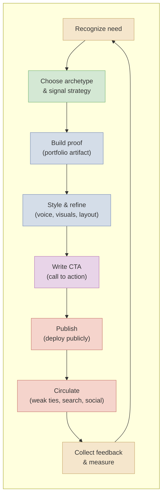
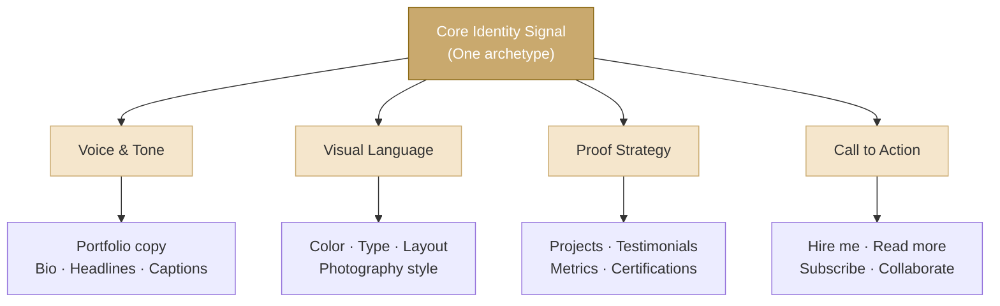
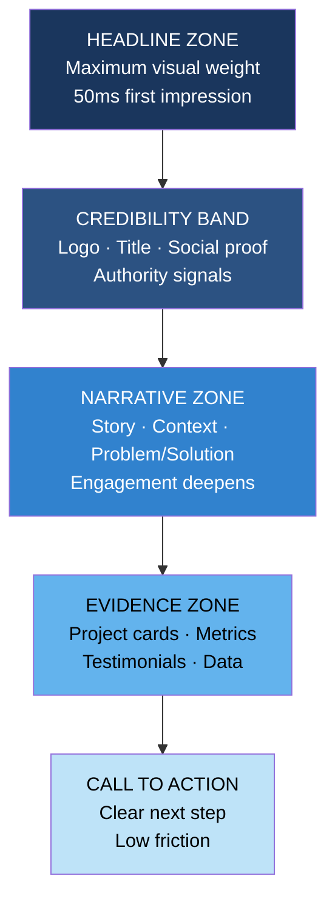
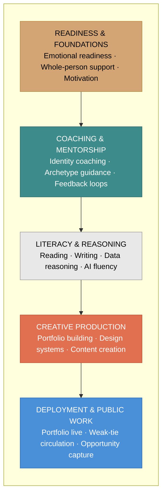
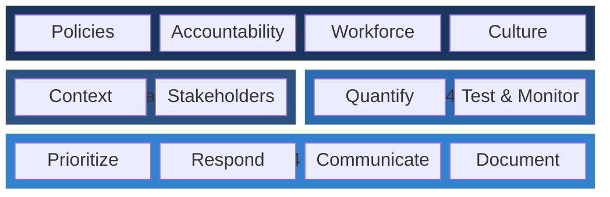
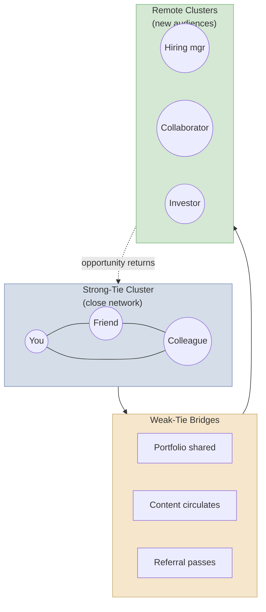

# Mermaid Diagram Prototypes

## Purpose

Reusable Mermaid diagram code for the concept diagrams planned in the diagram inventory.

These can be embedded in markdown, rendered in the site, or exported to SVG for production.

## 1. Motivation to Opportunity Chain

```mermaid
flowchart LR
    subgraph NEED["1. Need"]
        N1[Deficiency need<br/>or growth need]
    end
    subgraph SIGNAL["2. Signal"]
        S1[Archetype]
        S2[Voice & style]
        S3[Visual identity]
    end
    subgraph PROOF["3. Proof"]
        P1[Portfolio artifacts]
        P2[Testimonials]
        P3[Metrics & outcomes]
    end
    subgraph PUBLISH["4. Publish"]
        PU1[Deploy publicly]
        PU2[Weak-tie circulation]
        PU3[Search & social reach]
    end
    subgraph OPPORTUNITY["5. Opportunity"]
        O1[Trust forms]
        O2[Offers arrive]
        O3[New needs emerge]
    end
    NEED --> SIGNAL --> PROOF --> PUBLISH --> OPPORTUNITY
    OPPORTUNITY -.->|feedback loop| NEED
    style NEED fill:#f5e6cc,stroke:#c9a96e
    style SIGNAL fill:#d4e8d4,stroke:#7ab87a
    style PROOF fill:#d4dde8,stroke:#7a8eb8
    style PUBLISH fill:#e8d4e8,stroke:#b87ab8
    style OPPORTUNITY fill:#f5d4cc,stroke:#c97a6e
```

## 2. Need to Publish Loop

## 3. Archetype Coherence Model

## 4. First-Read Hierarchy Ladder

## 5. Whole-Person Education Stack

## 6. NIST AI RMF Core Functions

## 7. Second-Renaissance Institutional Shift

```mermaid
flowchart LR
    subgraph OLD["Pre-AI Model"]
        direction TB
        O1["Degree = credential"]
        O2["GPA = filter"]
        O3["Institution = brand"]
        O4["Transcript = proof"]
    end
    subgraph SHIFT["Transition Forces"]
        direction TB
        T1["AI changes task landscape"]
        T2["Skills-based hiring rises"]
        T3["Public work becomes visible"]
        T4["Portfolio replaces transcript"]
    end
    subgraph NEW["Post-AI Model"]
        direction TB
        N1["Identity portfolio = credential"]
        N2["Proof of work = filter"]
        N3["Individual signal = brand"]
        N4["Public artifacts = proof"]
    end
    OLD --> SHIFT --> NEW
    style OLD fill:#e8d4d4,stroke:#b87a7a
    style SHIFT fill:#f5e6cc,stroke:#c9a96e
    style NEW fill:#d4e8d4,stroke:#7ab87a
```

## 8. Weak-Ties Opportunity System

