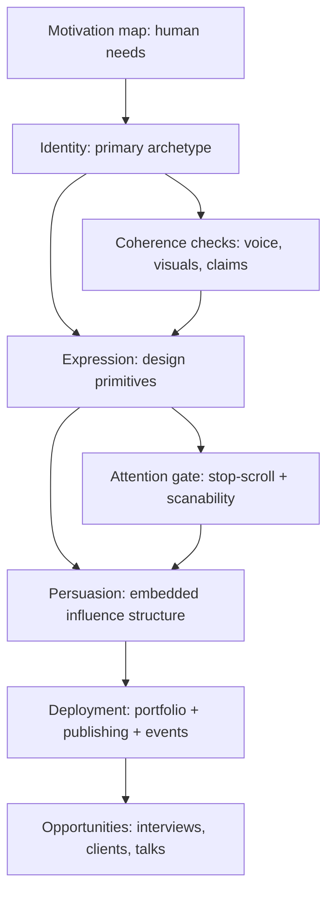
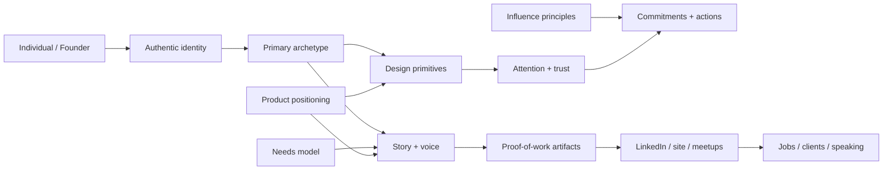

# A Research-Grounded Analysis of Your Identity-to-Opportunity Design and Brand System

## Status and role

- Status: supporting evidence base for the identity portfolio system
- Read this after `docs/_research/identity-system-core.md` when you need research grounding, caveats, or the longer argument behind a claim
- Companion docs: `docs/_research/identity-system-student-handout.md`, `docs/_research/identity-system-maintainer-doctrine.md`, and `docs/_research/mysystem.md`
- This file validates and limits the system; it is not the first document students should read

## How to use this file

Use this document when you need to answer one of these questions:

- What evidence supports this teaching move?
- What are the limits or caveats behind this claim?
- Which research trail should I follow if I need the long version?

## Executive summary

This file is the long-form research basis behind the system. It should support the core document, not compete with it.

The working order is simple:

1. Read `docs/_research/identity-system-core.md` for the usable model.
2. Read `docs/_research/mysystem.md` for the compressed blueprint.
3. Use this file when you need the longer validation, nuance, and citations.

Your framework is a coherent, multi-layer **behavior + design + career** system that can be modeled as a pipeline:

**Motivation (human needs) → Identity (archetype) → Perception (visual cognition + design) → Trust and action (persuasion + conversion) → Deployment (distribution channels) → Opportunity (jobs/clients/speaking)**.

What makes it unusually strong is that it connects (a) **why people act** (motivation and identity formation), (b) **how people notice and interpret signals** (attention and cognition), (c) **why people comply or commit** (persuasion science), and (d) **how opportunities actually form** (signaling + weak ties + consistent public artifacts). This “full-stack” integration is rare in typical portfolio teaching and closer to how mature brands and systems-oriented design organizations operate.

Key research-grounded validations:

- Your Maslow-based “self-actualization pull” is directionally aligned with motivation science, but the **strict hierarchy order is not strongly supported** empirically; modern evidence suggests needs can matter simultaneously and the “ladder order” varies by context. This is a limitation you can explicitly encode as a system rule: **Maslow as a needs map, not a rigid staircase**. citeturn0search4turn2search4turn2search1
- Your use of archetypes is defensible as a **meaning system** used in branding and cultural cognition, but it is not uniformly “hard science.” There is also emerging evidence that strong brands sometimes evoke **multiple archetypes**, which appears to contradict your “one archetype” rule; the reconciliation is: **one primary archetype for coherence, with controlled secondary traits** (hierarchy, not mixture). citeturn1search5turn15search2turn15search16
- Your “faces buy extra attention” heuristic is supported by evidence that humans have specialized face processing (e.g., face-sensitive neural markers and specialized cortical regions), and by eye-tracking work showing faces can capture attention and guide gaze. What you should tighten is the **timing claim**: users can form impressions extremely fast (tens to hundreds of milliseconds), while fixations often average ~200–250 ms; “+1.5 seconds” should be treated as a **testable target**, not a universal constant. citeturn0search2turn2search6turn11search2turn3search9turn11search13
- Your deployment plan (portfolio + LinkedIn publishing + meetups + speaking ladder) is strongly consistent with labor-market research on **signaling** and **weak-tie network advantages** in job access and opportunity flow. citeturn5search2turn5search3turn9search0
- Your “AI-era shift” rationale is supported by major institutions: AI exposure is substantial in many economies and will reshape tasks and skill demand; organizations are emphasizing **AI competency plus leadership/social influence and customer/service orientation**, supporting your emphasis on human qualities and visible initiative. citeturn4search2turn8search11turn8search6turn8search0turn4search3

Where the system becomes productizable is the “constraints enforcement” layer: what you call Ordo-like determinism aligns with how design systems and modern LLM-agent paradigms work—structured primitives, rule checks, and guided flows. citeturn7search0turn7search1turn7search6turn7search11

Below is a rigorous grounding of each layer, explicit limits/contradictions, and a set of actionable system rules: **invariants, forbidden states, evaluation rubric, UX rules, and agent behaviors**, plus an MVP product spec.

## Psychological foundations

Your psychological base has two components: **motivation** plus **identity formation**.

### Motivation: needs and “permissionless” self-actualization

You ground the system in entity["people","Abraham Maslow","psychologist hierarchy of needs"]: people are pulled toward growth and self-actualization, and your teaching frames “service to others” as the ethical justification for not waiting for permission to begin becoming. Maslow’s original 1943 paper argues for a layered structure of needs and emphasizes that higher motives become salient as other needs are sufficiently gratified. citeturn0search4turn0search0

**Limit/contradiction:** Empirical reviews have repeatedly found only partial support for a strict “need hierarchy order,” especially the deprivation/domination proposition across all layers. citeturn2search4turn2search8  
More contemporary cross-national work suggests multiple needs correlate with well-being across countries, but **the order** is not reliably determinant. citeturn2search1turn2search5

**Implication for your system:** Teach Maslow as a **needs taxonomy for message-market alignment**, not as a literal rung-by-rung ladder. Concretely:

- Use Maslow to answer: “Which need is this archetype promising to help satisfy?”
- Avoid claiming: “You must fully satisfy lower needs before higher needs matter.”

This also aligns with your “tilt probabilities” framing: you are mapping motivational gravity, not asserting deterministic sequences.

### Identity formation: authenticity, agency, and coherent self-presentation

Your “find your true archetype” principle aligns with established identity formation concepts: identity is developed through exploration, commitment, and integration (classically articulated in entity["people","Erik Erikson","developmental psychologist"]’s work on identity and culture). citeturn1search10turn1search18

Your emphasis on **actionable authentic steps** also converges with self-determination theory: entity["people","Richard Ryan","psychologist self-determination theory"] and entity["people","Edward Deci","psychologist self-determination theory"] argue that autonomy, competence, and relatedness support intrinsic motivation and growth. citeturn1search7turn1search11

Your “service orientation” framing matters here: authenticity tends to be defined as the unobstructed operation of one’s true self in daily activity, and is linked in the literature to healthier functioning and well-being; it also underpins perceived integrity in leadership contexts. citeturn9search18turn9search3turn9search19

**Implication for your system:** Your “one archetype” rule is psychologically coherent as a coherence constraint: it reduces identity diffusion and supports consistent self-presentation (which increases trust over repeated exposures). It also protects novices from “performative mismatch.”

### Archetypes: meaning systems, not diagnostic science

Your archetype layer bridges two worlds:

- entity["people","Carl Jung","psychiatrist and founder of analytical psychology"]: archetypes as patterns in cultural/psychic life. citeturn1search12turn15search20
- Brand archetypes as a practical branding shorthand (not a clinical taxonomy), popularized in business by entity["people","Margaret Mark","brand strategist"] and entity["people","Carol S. Pearson","author and psychologist"]. citeturn1search5turn1search9

**Limit/contradiction:** Jungian archetypes have longstanding critiques around operationalization and testability in behavioral science. citeturn15search20  
At the same time, more recent marketing research has begun empirically analyzing archetype usage at scale and suggests strong brands sometimes evoke **multiple archetypes**, challenging simplistic “single archetype only” rules. citeturn15search2turn15search19

**Reconciliation for your rule:**  
For _students/founders_, your “one archetype” is best reframed as:

- **One primary archetype (dominant constraint)**
- Optional: **one secondary archetype (subtle flavor)**
- Never: chaotic mixing without hierarchy

That preserves signal clarity while acknowledging real-world brand complexity.

## Persuasion science and ethics

Your persuasion layer sits on evidence that people often rely on cognitive shortcuts under uncertainty and limited attention—exactly the conditions of modern digital environments.

### Cialdini principles as embedded structure

Your applied persuasion model is primarily entity["people","Robert Cialdini","psychologist and persuasion author"]’s influence principles (reciprocity, consistency/commitment, social proof, authority, liking, scarcity; later public articulations add “unity”). citeturn0search5turn0search13

Your system’s sophistication is that you want these to be **structural** (built into narrative and interfaces), not “sales overlays.” That aligns with the idea that persuasion works best as an environmental/contextual factor rather than an obvious manipulation.

### Behavioral economics: why structure matters

Persuasion is more predictable when you account for bounded rationality and heuristic judgment. Classic papers by entity["people","Amos Tversky","cognitive psychologist"] and entity["people","Daniel Kahneman","psychologist and Nobel laureate"] formalize how heuristics systematically shape judgment under uncertainty. citeturn3search4turn3search7

**Implication for your UX:** Clear hierarchy, credible signals, and simple commitments matter because users will not compute your value proposition “fully rationally” in real time.

### Ethics: your “service-first permissionless” stance is a guardrail

Your framework risks being misread as “growth hacking” unless you explicitly encode ethics. You already have the right safeguard: “permissionless becomes moral when it is aimed at helping others and you stay within legal constraints.”

Operationally, you can anchor your persuasion doctrine to widely recognized marketing ethics norms (e.g., entity["organization","American Marketing Association","professional association"] emphasizes “do no harm,” transparency, fairness, and integrity). citeturn3search2turn3search5

**Actionable ethical rule set (system-level):**

- Never use deception patterns (e.g., “dark patterns,” fake urgency). This is consistent with the ethics critique embedded even in applied UX research discussions of deceptive ad-like interfaces. citeturn11search1
- Use social proof as **verifiable outcomes**, not vague claims.
- Use authority as **real credentials + real artifacts**, not “borrowed status.”
- Make reciprocity real (a genuinely helpful session or resource), not a bait.

This strengthens your professional positioning (Sage archetype) while retaining conversion effectiveness.

## Attention and visual cognition

Your “faces buy time” intuition sits on a strong foundation: humans are biologically and cognitively tuned for faces, eyes, and social cues.

### Why faces work: specialized processing and preferential attention

Face perception is supported by specialized neural and cognitive mechanisms:

- Face-sensitive ERP signals (notably the N170) appear rapidly after stimulus onset, supporting very fast face-category processing. citeturn0search2turn0search20
- Neuroimaging work identifies face-selective regions such as the fusiform face area (FFA) that respond more strongly to faces than many other visual categories. citeturn2search6turn2search2
- In both lab and more naturalistic research, faces are often processed preferentially relative to non-face stimuli. citeturn4search5turn4search1

### How much time do you actually “buy”?

Two timing anchors matter:

- Immediate aesthetic judgments and first impressions of web pages can form extremely quickly—on the order of tens to hundreds of milliseconds in controlled exposures. citeturn3search9turn3search13
- Typical fixation durations in reading tasks are often around ~200–250 ms on average (with wide variability). citeturn11search2turn0search11

**Implication:** The claim “a face buys 1.5 seconds every time” should be reframed as a **performance hypothesis**:

> “Faces can increase initial fixation probability and guide subsequent gaze, potentially increasing dwell time long enough for the headline to be parsed.”

That is both more defensible and more measurable.

### Eye-tracking evidence: scanning behavior, gaze cueing, and banner blindness

Web attention is dominated by scanning patterns:

- Users often scan rather than read word-by-word, and eye-tracking studies show systematic scan shapes (e.g., the “F-pattern”), especially for text-heavy pages. citeturn11search3turn11search0
- “Banner blindness” shows that ad-like elements can be ignored even if visually salient, implying that faces used in a way that resembles advertising may be discounted. citeturn11search1turn11search5

Critically, faces can do more than attract attention; eyes can also **direct** attention:

- Gaze cueing research shows reflexive orienting effects where gaze direction shifts attention even when it is not predictive. citeturn4search0turn4search4
- Eye-tracking research in advertising contexts has directly tested whether faces (and gaze direction) can mitigate banner blindness and guide attention to key elements. citeturn11search13

**Limit/nuance:** Gaze cueing is not uniquely “magical”; symbolic cues like arrows can sometimes produce similar orienting effects, and context matters. citeturn4search8turn4search12

### Visual aid: what to test and how to visualize it

image_group{"layout":"carousel","aspect_ratio":"16:9","query":["Nielsen Norman Group F-shaped pattern eye tracking heatmap","website eye tracking heatmap hero section face gaze CTA","banner blindness eye tracking heatmap web page","gaze cueing advertisement eye tracking heatmap face looking at product"],"num_per_query":1}

**Recommended eye-tracking (or click/scroll proxy) chart for your site:**  
Create a hero A/B test (face vs no face; face gaze toward CTA vs neutral), then plot:

- Heatmap of fixations (or cursor/scroll proxies) over the hero
- Time-to-first-fixation on headline
- Time-to-first-fixation on CTA
- CTA click-through rate and downstream conversion

This directly tests your “attention buy” claim and favors measurable improvement over folklore.

## Branding and design lineage with analogous case patterns

Your system is essentially a synthesis of three traditions: Swiss/structural clarity, direct-response persuasion discipline, and experiential narrative coherence at scale.

### Design lineage: hierarchy and grids as trust infrastructure

Your “clarity earns trust” impulse aligns with long-standing information design principles:

- Grid-based composition and typographic hierarchy are canonical tools for producing predictable scanning and comprehension; Swiss grid approaches are codified in texts like Josef Müller-Brockmann’s grid methodology. citeturn6search18turn6search14
- Modern platform HIGs (notably Apple’s) explicitly emphasize hierarchy and legibility as core interface values: typography helps communicate hierarchy and elevate content. citeturn6search0turn6search6

### Case patterns: coherence across touchpoints

A useful principle you implicitly share with high-performing brands is the Disney-style “everything speaks” doctrine: every detail emits a signal and should align with the promise. This concept appears in Disney Institute–adjacent business literature and is widely repeated in service design contexts (often linked to Imagineering and guest experience). citeturn14search10turn14search8turn6search12

image_group{"layout":"carousel","aspect_ratio":"16:9","query":["Apple website hero product page minimal typography hierarchy","David Ogilvy Rolls Royce ad 'At 60 miles an hour' layout","Walt Disney Imagineering concept art design process","Swiss International Typographic Style grid poster Josef Muller-Brockmann"],"num_per_query":1}

### Comparison table of analogous systems or figures

The point of this table is not “who did it first,” but what each exemplar contributes—and what your system adds by integrating them.

| Analog system / exemplar                                                                               | What they systematize                               | Primary strength                                 | Typical weakness / gap vs your system                                                         |
| ------------------------------------------------------------------------------------------------------ | --------------------------------------------------- | ------------------------------------------------ | --------------------------------------------------------------------------------------------- |
| Apple / entity["people","Steve Jobs","Apple co-founder"]                                            | Coherence across product, messaging, experience     | Constraint-driven clarity; brand “inevitability” | Less explicit about underlying persuasion science; often implicit                             |
| entity["people","David Ogilvy","advertising pioneer"]                                               | Direct-response discipline; every element has a job | Clarity + evidence-led selling                   | Less emphasis on identity formation and motivation psychology as a system                     |
| entity["organization","The Walt Disney Company","entertainment company"] / Disney Institute pattern | End-to-end experience as narrative                  | “Everything speaks” coherence                    | Not designed as a portable personal-brand career OS                                           |
| entity["people","Robert Cialdini","psychologist and persuasion author"]                             | Behavioral influence principles                     | Predictable compliance levers                    | Doesn’t specify visual/design implementations or identity authenticity constraints by default |
| entity["people","Marc Andreessen","venture capitalist"] PMF doctrine                                | Product-market fit primacy                          | Market clarity and fit focus                     | Doesn’t address personal identity + signaling; assumes startup context citeturn5search0    |
| entity["people","Brad Frost","designer and author"] design systems                                  | UI decomposition + constraints                      | Repeatable consistency                           | Not a motivation + persuasion + career deployment engine citeturn7search0turn7search4     |

Your unique contribution is the integrated “career operating system” aspect: **identity + attention + persuasion + deployment** in a single deterministic pipeline.

## Productization, market fit, and AI-era labor shifts

This is where your system becomes not only “good pedagogy,” but plausible as a product.

### Product-market fit framing applied to a personal career product

In startup terms, entity["people","Marc Andreessen","venture capitalist"] defines product/market fit as being in a good market with a product that can satisfy it, and notes PMF has observable symptoms: pull, usage growth, shorter sales cycles, stronger word of mouth. citeturn5search0turn5search4

Your move is to apply this logic to individuals and solopreneurs:

- The “product” is the portfolio + artifact + narrative bundle
- The “market” is the niche + meetup ecosystem + LinkedIn audience
- “Fit” is observed as inbound messages, intros, interviews, small paid projects, and talk invites

This is a legitimate mapping because hiring and client acquisition are also markets with information asymmetry.

### AI-era labor shifts: why “signal + adaptability” becomes central

Major institutional reports indicate:

- Significant occupational exposure to AI/generative AI and task reshaping rather than uniform displacement. citeturn8search0turn4search3turn4search19
- Employer-facing forecasts highlight shifting skills: leadership/social influence, service orientation/customer service, AI and data literacy, talent management, and other human/coordination skills are rising in relevance. citeturn8search11turn8search3
- OECD work suggests AI changes skill demand and shows high-exposure vacancies often demand management/business process skills and social/emotional/digital skills. citeturn8search6turn8search2turn8search10

This supports your claim that traditional task-based skills may be partially commoditized and that “human qualities” plus visible initiative and service become differentiators—especially for project-based consulting and hybrid work.

### Gig/side-work signals: multi-jobholding and platform work

Your “most people have side businesses / multiple income patterns” claim is directionally consistent with labor data showing meaningful levels of multiple jobholding, and has remained a measurable labor-market phenomenon in official statistics. citeturn5search1turn5search9  
Additionally, the entity["organization","International Labour Organization","un specialized agency"] documents the growth and complexity of digital labor platforms and associated work models, reinforcing the plausibility of “portfolio-like” careers and intermittent/project-based work patterns. citeturn8search1turn8search9

**Limit:** Projections about what will “become normal” remain uncertain; institutional reports emphasize transformation and reallocation, but the pace and distribution of impacts vary widely by country, industry, and policy. citeturn4search2turn4search7turn8search0

**Implication for your system:** Your framework should present “AI-era change” as a **risk-managed adaptation rationale** (build portable signals; build networks; ship artifacts), not as deterministic alarmism. That keeps it professional and credible.

## Operationalizing the framework into rules, tables, and an MVP agent product

This section converts your ideas into implementable constraints.

### System flow diagram

### Entity relationship diagram

### Mapping table: archetype → needs → design primitives → persuasion tactics

This table assumes “one primary archetype” and is meant to guide consistent design decisions. Archetype concepts are drawn from brand-archetype practice literature, while needs and persuasion map to Maslow and Cialdini frameworks. citeturn1search5turn0search4turn0search5

| Primary archetype | Primary need-pull (needs map)                          | Design primitives (what to standardize)                                        | Persuasion emphasis (embedded, not bolted)          |
| ----------------- | ------------------------------------------------------ | ------------------------------------------------------------------------------ | --------------------------------------------------- |
| Sage              | competence, clarity, meaning (esteem/cognitive growth) | grid, strong hierarchy, restrained palette, “proof blocks,” precise typography | authority + consistency; show method and receipts   |
| Explorer          | autonomy, discovery, expansion (growth/self-direction) | journey metaphors, open loops, bold headlines, “map” layouts, dynamic imagery  | curiosity + commitment; invite small experiments    |
| Magician          | transformation, possibility (self-actualization)       | before/after visuals, “system diagrams,” transformation language, contrast     | reciprocity + social proof; “here’s what changes”   |
| Caregiver         | belonging, safety, support                             | warm human imagery, accessibility-first layout, reassurance microcopy          | liking + reciprocity; emphasize care and protection |
| Hero              | achievement, competence, challenge                     | high-contrast CTAs, goal language, milestones, performance metrics             | commitment + scarcity; rally to a clear outcome     |
| Everyman          | belonging, simplicity, inclusion                       | plain language, approachable visuals, pragmatic templates                      | social proof + liking; “people like you succeed”    |
| Ruler             | order, certainty, control                              | structured architecture, premium spacing, “operating model” visuals            | authority + consistency; “this is the standard”     |

**Important limit:** Research suggests strong brands may evoke multiple archetypes; your system can honor that by permitting “secondary traits” while keeping a primary constraint for coherence. citeturn15search2turn15search19

### Invariants, forbidden states, and an evaluation rubric

These are the enforceable rules that prevent the system from turning into a set of disconnected tactics.

#### Invariants

Your system works best when these remain true:

- One primary archetype governs voice + visuals + proof selection.
- Every page/asset has a single job: attention, understanding, trust, or action (not all at once).
- Proof-of-work is concrete and verifiable (artifact > claim).
- Deployment is continuous: publish + show up + follow up (weak ties compound). citeturn5search3turn9search0turn5search2

#### Forbidden states

- Mixed archetypes with no hierarchy (“identity blur”).
- Face/novelty imagery without semantic connection to the promise (attention without meaning).
- Persuasion that is visible as manipulation (fake scarcity, deceptive UI). citeturn11search1turn3search2
- Portfolio not tied to a narrative and a call-to-action (artifact without conversion path).
- Distribution avoided (“I built it, now I wait”).

#### Evaluation rubric

| Dimension        | What “good” looks like                          | How to score |
| ---------------- | ----------------------------------------------- | ------------ |
| Coherence        | archetype is obvious from 5 seconds of scanning | 1–5          |
| Clarity          | value prop is understood in one sentence        | 1–5          |
| Proof            | artifacts demonstrate capability, not vibes     | 1–5          |
| Ethics           | claims are honest; incentives are non-deceptive | 1–5          |
| Deployment       | consistent publishing + real-world engagement   | 1–5          |
| Market alignment | defined audience + problem + fit signals        | 1–5          |

### UX rules grounded in attention research

These are pragmatic rules that map to the scanning/attention evidence:

- Design for scanning first, reading second (headlines, short blocks, predictable hierarchy). citeturn11search3turn11search0
- Treat faces as **attention anchors**, not decoration; if used, align gaze direction with the headline/CTA to exploit gaze cueing. citeturn4search0turn11search13
- Avoid ad-like layouts that trigger banner blindness. citeturn11search1turn11search5
- Assume the first impression happens extremely fast; your hero must communicate “what this is” immediately. citeturn3search9turn3search13

### Recommended MVP product spec: website first, then an agent

The MVP sequence you proposed is consistent with a low-risk path: demonstrate the doctrine publicly, then automate it.

#### MVP website: the teaching + demonstration artifact

##### Five-step guided flow

1. **Choose a primary archetype** (with constraint checks; optional secondary trait).
2. **Map to needs** (what human need you serve; what promise you make).
3. **Define one product** (portfolio-as-product: who it’s for, what it solves).
4. **Generate proof artifacts** (portfolio page template + case narrative + CTA).
5. **Deploy** (LinkedIn article draft + business card QR asset + meetup script).

This flow operationalizes identity → proof → distribution using repeatable outputs.

#### Agent responsibilities: “constraint enforcer,” not chatbot

To productize as an agent, your differentiator is enforcement (design-system logic), not chatting.

##### Agent behavior requirements

- **Constraint satisfaction:** reject or flag archetype-incongruent choices (“this visual tone conflicts with your archetype”).
- **Structured generation:** produce artifacts in consistent templates (design-system approach). citeturn7search0turn7search1
- **Tool use / orchestration:** call specific generators (portfolio page, LinkedIn article, QR card) and integrate results—consistent with tool-using LLM paradigms. citeturn7search6turn7search11
- **Evaluation loop:** score coherence and clarity, then propose edits (like a rubric-driven reviewer).
- **Action prompts:** schedule deployment steps (meetup cadence, outreach scripts), leveraging commitment/consistency principles. citeturn0search5turn5search3

#### Metrics: what to measure to prove value

##### Product success metrics

- Flow completion rate (Step 1→5)
- Coherence score improvement (rubric before/after)
- Portfolio conversion rate (CTA click, inquiry submissions)
- Publishing cadence (articles/posts per month)
- Opportunity signals (inbound messages, interviews, paid calls, talk invites)

##### UX/attention metrics

- Time-to-first-click on CTA
- Scroll depth
- Hero dwell time
- Heatmap shift: CTA and headline fixation increase in “face gaze → CTA” condition citeturn11search13turn4search0

---

### Endnote on what to claim vs what to test

The research base strongly supports your **directional** claims: attention is scarce, faces and gaze cues can shape attention, persuasion works through predictable principles, identity coherence improves signal clarity, and opportunity flow is shaped by weak ties and signaling. citeturn11search0turn11search13turn0search5turn5search2turn5search3

The most important professional upgrade is to convert your strongest heuristics (e.g., “faces buy 1.5 seconds”) into **measured hypotheses** with simple A/B and attention visualizations. That maintains your system’s authority while preserving its experimental Explorer edge.
